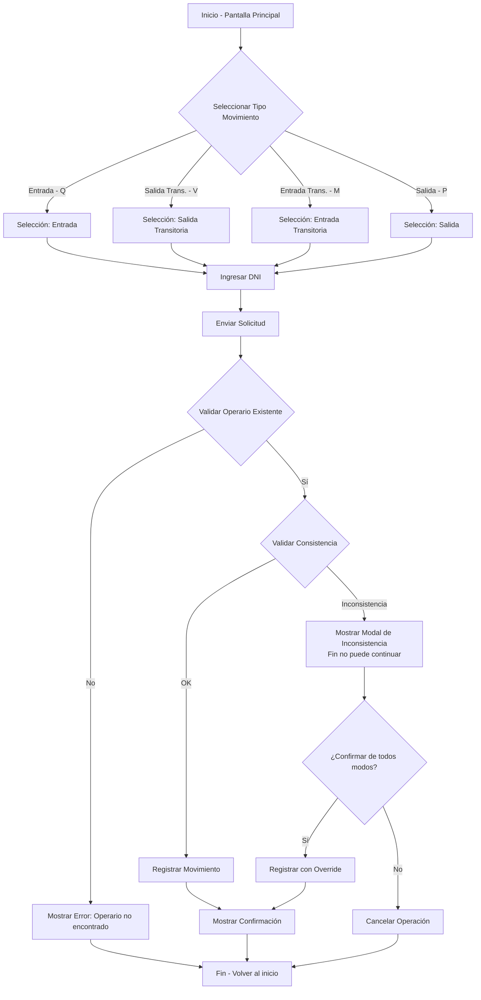
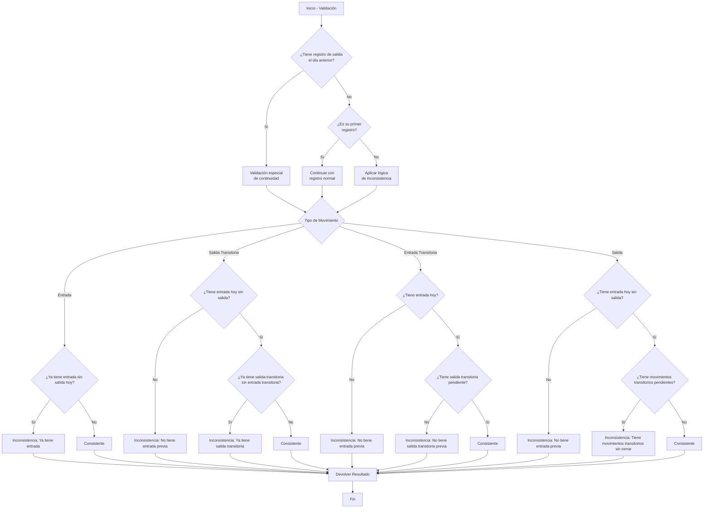
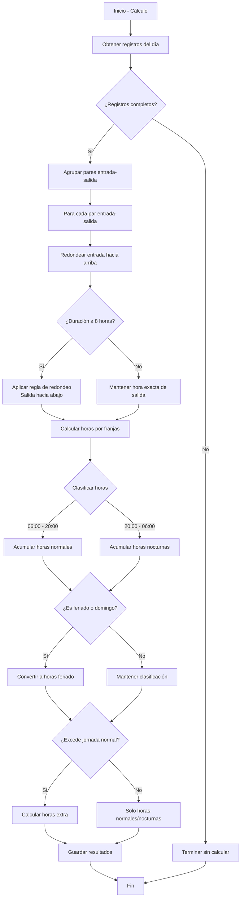
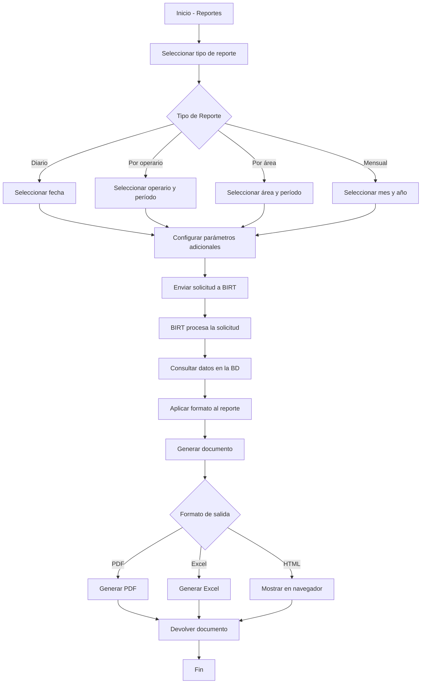
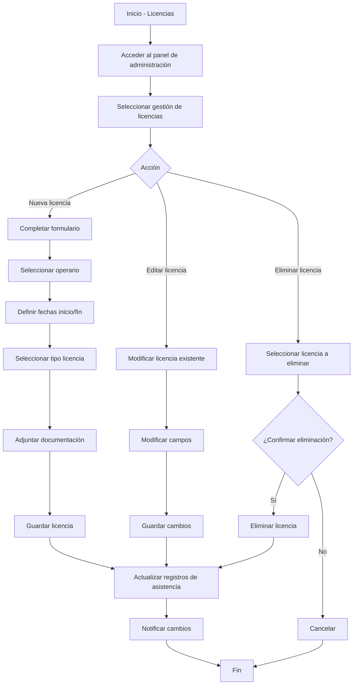
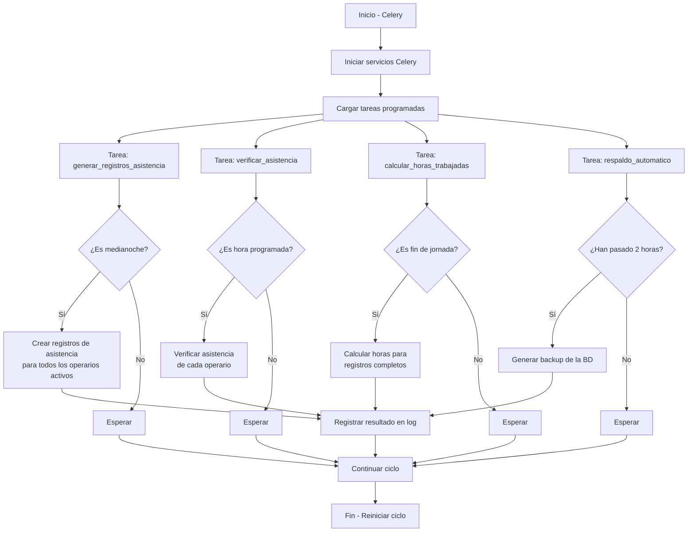

# Diagrama de Flujo del Sistema Reloj Fichador

> [!info] Navegación
> **Índice Principal:** [[Indice_Reloj_Fichador|Índice del Sistema]]  
> **Contexto:** [[contexto|Contexto del Proyecto]]  
> **Otras Visualizaciones:** [[Diagrama_de_flujo_Visual|Visual]] | [[Diagrama_de_flujo_ASCII|ASCII]]  
> **Arquitectura:** [[estructura|Estructura del Proyecto]]

Este documento presenta los principales flujos de trabajo del sistema Reloj Fichador a través de diagramas para facilitar la comprensión de su funcionamiento.

## Índice
1. [Registro de Movimientos](#registro-de-movimientos)
2. [Validación de Inconsistencias](#validación-de-inconsistencias)
3. [Cálculo de Horas Trabajadas](#cálculo-de-horas-trabajadas)
4. [Generación de Reportes](#generación-de-reportes)
5. [Gestión de Licencias](#gestión-de-licencias)
6. [Ciclo de Vida de Tareas Programadas](#ciclo-de-vida-de-tareas-programadas)
7. [Algoritmo de Cálculo de Horas por Franjas](#algoritmo-de-cálculo-de-horas-por-franjas)

## Registro de Movimientos



## Validación de Inconsistencias



## Cálculo de Horas Trabajadas



## Generación de Reportes



## Gestión de Licencias



## Ciclo de Vida de Tareas Programadas



## Algoritmo de Cálculo de Horas por Franjas

```mermaid
flowchart TD
    classDef inicio fill:#b3e0ff,stroke:#333,stroke-width:2px,color:#000
    classDef proceso fill:#f2f2f2,stroke:#333,stroke-width:1px,color:#000
    classDef decision fill:#ffffcc,stroke:#ffcc00,stroke-width:2px,color:#000,font-weight:bold
    classDef franjas fill:#ffccff,stroke:#cc00cc,stroke-width:2px,color:#000
    
    A[Inicio - calcular_horas_por_franjas] --> B[Recibir parámetros: inicio, fin, limites]
    B --> C{¿USE_TZ está<br>habilitado?}
    C -->|Sí| D[Normalizar fechas<br>con timezone.make_aware]
    C -->|No| E{¿Se proporcionaron<br>límites?}
    D --> E
    
    E -->|No| F[Establecer límites por defecto]
    E -->|Sí| G[Usar límites proporcionados]
    
    F --> H[Definir franjas horarias]
    G --> H
    
    subgraph limites_default [Límites por defecto]
        F1[Horas nocturnas: 20:00 a 06:00]
        F2[Horas normales: 04:00 a 22:00]
    end
    
    H --> I[Inicializar variables:<br>actual = inicio<br>total_normales = 0<br>total_nocturnas = 0]
    I --> J{¿actual < fin?}
    J -->|No| K[Retornar total_normales, total_nocturnas]
    J -->|Sí| L[Determinar siguiente punto de corte]
    
    L --> M[Identificar posibles puntos de corte:<br>- fin<br>- límites relevantes > actual]
    M --> N[siguiente = min(posibles_cortes)]
    N --> O{¿siguiente <= actual?}
    O -->|Sí| P[siguiente = actual + 1 hora<br>o fin si es menor]
    O -->|No| Q{¿Es horario normal?<br>4am-21hs → 5am-22hs}
    P --> Q
    
    Q -->|Sí| R[total_normales += siguiente - actual]
    Q -->|No| S{¿Es horario nocturno?<br>20hs-5am → 21hs-6am}
    S -->|Sí| T[total_nocturnas += siguiente - actual]
    S -->|No| U[Sin clasificar]
    
    R --> V[actual = siguiente]
    T --> V
    U --> V
    
    V --> J
    
    K --> W[Fin - Devolver totales]
    
    class A,W inicio
    class B,D,I,L,M,N,P,R,T,U,V proceso
    class C,E,J,O,Q,S decision
    class F,G,F1,F2 franjas
```

## Notas adicionales

- **Redondeo de horas**: El sistema aplica reglas específicas para el redondeo de horas, considerando que la entrada se redondea hacia arriba a la próxima hora completa, y la salida hacia abajo a la hora anterior si se han trabajado al menos 8 horas.

- **Clasificación de horas**: Las horas se clasifican en normales (06:00-20:00), nocturnas (20:00-06:00), extras (excedentes a jornada regular) y feriado (trabajadas en días festivos o domingos).

- **Validación de consistencia**: El sistema realiza validaciones para evitar secuencias ilógicas de fichadas (por ejemplo, salida sin entrada previa). También se consideran registros del día anterior para mantener la consistencia entre días.

- **Validaciones previas**: Antes de evaluar la consistencia específica del tipo de movimiento, se verifica si el operario tiene un registro de salida del día anterior y si es su primer registro, lo que determina el flujo de validación a seguir.

- **Teclas de acceso rápido**: El sistema utiliza teclas específicas para cada tipo de movimiento: Q (Entrada), V (Salida Transitoria), M (Entrada Transitoria) y P (Salida).

- **Override de inconsistencias**: Aunque se detecte una inconsistencia, el sistema permite al usuario confirmar el registro si es necesario, registrando esta excepción.

- **Cálculo detallado de franjas horarias**:
  - **Horas normales**: Validadas cuando el ingreso está entre 4:00 y 21:00, y la salida entre 5:00 y 22:00.
  - **Horas nocturnas**: Validadas cuando el ingreso está entre 20:00 y 5:00, y la salida entre 21:00 y 6:00.
  - **Algoritmo iterativo**: La función calcula las horas por segmentos, avanzando a través de los límites de franjas horarias hasta llegar al fin del periodo.

---

> [!tip] Documentos Relacionados
> - Para entender el contexto y reglas de negocio, consulta [[contexto|Contexto del Proyecto]]
> - Para una visualización avanzada con colores e iconos, ve a [[Diagrama_de_flujo_Visual|Diagramas Visuales]]
> - Para una visualización en ASCII art, revisa [[Diagrama_de_flujo_ASCII|Diagramas ASCII]]
> - Para entender la estructura técnica, consulta [[estructura|Arquitectura del Proyecto]]
> - Regresa al [[Indice_Reloj_Fichador|Índice Principal]] 