# Diagrama de Flujo Visual - Sistema Reloj Fichador

> [!info] Navegación
> **Índice Principal:** [[Indice_Reloj_Fichador|Índice del Sistema]]  
> **Contexto:** [[contexto|Contexto del Proyecto]]  
> **Otras Visualizaciones:** [[Diagrama_de_flujo_Fichador|Mermaid]] | [[Diagrama_de_flujo_ASCII|ASCII]]  
> **Arquitectura:** [[estructura|Estructura del Proyecto]]

Este documento presenta diagramas visuales mejorados del sistema Reloj Fichador con elementos gráficos avanzados para facilitar su comprensión.

## Proceso Principal de Fichaje

```mermaid
%%{init: { 'theme': 'forest', 'themeVariables': {'fontSize': '16px'} } }%%
flowchart TD
    classDef inicio fill:#b3e0ff,stroke:#333,stroke-width:2px,color:#000
    classDef movimiento fill:#ffcc99,stroke:#ff8000,stroke-width:2px,color:#000
    classDef validacion fill:#ffffcc,stroke:#ffcc00,stroke-width:2px,color:#000,font-weight:bold
    classDef exito fill:#ccffcc,stroke:#00cc00,stroke-width:2px,color:#000
    classDef error fill:#ffcccc,stroke:#cc0000,stroke-width:2px,color:#000
    classDef proceso fill:#f2f2f2,stroke:#333,stroke-width:1px,color:#000
    
    A[("<b>INICIO</b><br>Pantalla de Fichaje")] --> B{"<b>Seleccionar Tipo</b>"}
    
    subgraph Tipos["<b>TIPOS DE MOVIMIENTO</b>"]
        C1["<img src='https://img.icons8.com/color/48/000000/login-rounded-right.png' width='30'/><br>Entrada<br>(Tecla Q)"]
        C2["<img src='https://img.icons8.com/color/48/000000/logout-rounded-left.png' width='30'/><br>Salida Transitoria<br>(Tecla V)"]
        C3["<img src='https://img.icons8.com/color/48/000000/login-rounded-right.png' width='30'/><br>Entrada Transitoria<br>(Tecla M)"]
        C4["<img src='https://img.icons8.com/color/48/000000/logout-rounded-left.png' width='30'/><br>Salida<br>(Tecla P)"]
    end
    
    B -->|"Q"| C1
    B -->|"V"| C2
    B -->|"M"| C3
    B -->|"P"| C4
    
    C1 & C2 & C3 & C4 --> D["<b>Ingresar DNI</b>"]
    
    D --> E["Enviar Solicitud"]
    
    subgraph Validaciones["<b>VALIDACIONES</b>"]
        F{"¿Operario<br>existe?"}
        H{"¿Secuencia<br>válida?"}
    end
    
    E --> F
    F -->|"❌ NO"| G["<b>ERROR</b><br>Operario no encontrado"]
    F -->|"✅ SÍ"| H
    
    H -->|"✅ OK"| I["<b>REGISTRO</b><br>Guardar movimiento"]
    H -->|"⚠️ INCONSISTENCIA"| J["<b>ADVERTENCIA</b><br>Mostrar alerta<br>Fin no puede continuar"]
    
    J --> K{"¿Confirmar<br>de todos<br>modos?"}
    K -->|"✅ SÍ"| L["<b>OVERRIDE</b><br>Registrar con<br>excepción"]
    K -->|"❌ NO"| M["<b>CANCELAR</b><br>Operación abortada"]
    
    I --> N["<b>ÉXITO</b><br>✅ Confirmación"]
    L --> N
    
    G & M & N --> O(["<b>FIN</b><br>Volver al inicio"])
    
    class A inicio
    class B,K validacion
    class C1,C2,C3,C4 movimiento
    class D,E,L proceso
    class G,M error
    class I,N exito
    class J validacion
    class F,H validacion
```



## Validación de Inconsistencias

```mermaid
%%{init: { 'theme': 'forest' } }%%
flowchart LR
    classDef proceso fill:#f2f2f2,stroke:#333,stroke-width:1px,color:#000
    classDef inconsistencia fill:#ffcccc,stroke:#cc0000,stroke-width:2px,color:#000
    classDef consistente fill:#ccffcc,stroke:#00cc00,stroke-width:2px,color:#000
    classDef movimiento fill:#ffcc99,stroke:#ff8000,stroke-width:2px,color:#000
    classDef validacion fill:#ffffcc,stroke:#ffcc00,stroke-width:2px,color:#000,font-weight:bold
    
    subgraph ValBasicas["<b>VALIDACIONES PREVIAS</b>"]
        direction TB
        Z1{"¿Tiene un registro<br>de salida el día<br>de ayer?"}
        Z1 -->|"SÍ"| Z2["Validación especial<br>de continuidad"]
        Z1 -->|"NO"| Z3{"¿Es su primer<br>registro?"}
        Z3 -->|"SÍ"| Z4["Continuar con<br>registro normal"]
        Z3 -->|"NO"| Z5["Aplicar lógica<br>de inconsistencia"]
    end
    
    subgraph entrada ["ENTRADA"]
        direction TB
        A1[/"Entrada"/] --> B1{"¿Ya tiene<br>entrada?"}
        B1 -->|"SÍ"| C1["❌ INCONSISTENTE"]
        B1 -->|"NO"| D1["✅ CONSISTENTE"]
        
        class A1 movimiento
        class B1 validacion
        class C1 inconsistencia
        class D1 consistente
    end
    
    subgraph salida_trans ["SALIDA TRANSITORIA"]
        direction TB
        A2[/"Salida<br>Transitoria"/] --> B2{"¿Tiene<br>entrada<br>hoy?"}
        B2 -->|"NO"| C2["❌ INCONSISTENTE"]
        B2 -->|"SÍ"| D2{"¿Ya tiene<br>salida trans?"}
        D2 -->|"SÍ"| E2["❌ INCONSISTENTE"]
        D2 -->|"NO"| F2["✅ CONSISTENTE"]
        
        class A2 movimiento
        class B2,D2 validacion
        class C2,E2 inconsistencia
        class F2 consistente
    end
    
    subgraph entrada_trans ["ENTRADA TRANSITORIA"]
        direction TB
        A3[/"Entrada<br>Transitoria"/] --> B3{"¿Tiene<br>entrada<br>hoy?"}
        B3 -->|"NO"| C3["❌ INCONSISTENTE"]
        B3 -->|"SÍ"| D3{"¿Tiene<br>salida trans?"}
        D3 -->|"NO"| E3["❌ INCONSISTENTE"]
        D3 -->|"SÍ"| F3["✅ CONSISTENTE"]
        
        class A3 movimiento
        class B3,D3 validacion
        class C3,E3 inconsistencia
        class F3 consistente
    end
    
    subgraph salida ["SALIDA"]
        direction TB
        A4[/"Salida"/] --> B4{"¿Tiene<br>entrada<br>hoy?"}
        B4 -->|"NO"| C4["❌ INCONSISTENTE"]
        B4 -->|"SÍ"| D4{"¿Movimientos<br>transitorios<br>pendientes?"}
        D4 -->|"SÍ"| E4["❌ INCONSISTENTE"]
        D4 -->|"NO"| F4["✅ CONSISTENTE"]
        
        class A4 movimiento
        class B4,D4 validacion
        class C4,E4 inconsistencia
        class F4 consistente
    end
    
    ValBasicas --> entrada
    entrada --> salida_trans
    salida_trans --> entrada_trans
    entrada_trans --> salida
```



## Cálculo de Horas Trabajadas

```mermaid
%%{init: { 'theme': 'forest' } }%%
flowchart TD
    classDef inicio fill:#b3e0ff,stroke:#333,stroke-width:2px,color:#000
    classDef decision fill:#ffffcc,stroke:#ffcc00,stroke-width:2px,color:#000,font-weight:bold
    classDef normal fill:#ccffcc,stroke:#00cc00,stroke-width:2px,color:#000
    classDef nocturna fill:#ccccff,stroke:#0000cc,stroke-width:2px,color:#000
    classDef proceso fill:#f2f2f2,stroke:#333,stroke-width:1px,color:#000
    classDef especial fill:#ffccff,stroke:#cc00cc,stroke-width:2px,color:#000
    
    A(["<b>INICIO CÁLCULO</b>"]) --> B["<b>Obtener registros</b><br>del día"]
    
    subgraph Preparación["<b>PREPARACIÓN DE DATOS</b>"]
        B --> C{"¿Registros<br>completos?"}
        C -->|"❌ NO"| D["⚠️ Sin calcular"]
        C -->|"✅ SÍ"| E["Agrupar pares<br>entrada-salida"]
    end
    
    subgraph Redondeo["<b>REGLAS DE REDONDEO</b>"]
        E --> F["<b>Por cada par</b><br>entrada-salida"]
        F --> G["⬆️ Redondear entrada<br>hacia arriba"]
        G --> H{"¿Duración<br>≥ 8 horas?"}
        H -->|"✅ SÍ"| J["Aplicar regla<br>especial<br>(redondeo hacia abajo)"]
        H -->|"❌ NO"| K["Mantener hora<br>exacta de salida"]
    end
    
    J & K --> L["<b>Calcular horas</b><br>por franjas"]
    
    subgraph Clasificación["<b>CLASIFICACIÓN DE HORAS</b>"]
        L --> M{"<b>Franja</b>"}
        M -->|"06:00-20:00"| N1["<b>HORAS NORMALES</b>"]
        M -->|"20:00-06:00"| N2["<b>HORAS NOCTURNAS</b>"]
        
        N1 & N2 --> O{"¿Es feriado<br>o domingo?"}
        O -->|"✅ SÍ"| P1["<b>HORAS FERIADO</b>"]
        O -->|"❌ NO"| P2["Mantener tipo"]
        
        P1 & P2 --> Q{"¿Excede jornada<br>normal?"}
        Q -->|"✅ SÍ"| R["<b>HORAS EXTRA</b>"]
        Q -->|"❌ NO"| S["Solo horas<br>regulares"]
    end
    
    R & S --> T["<b>Guardar resultados</b><br>en base de datos"]
    D & T --> U(["<b>FIN CÁLCULO</b>"])
    
    class A,U inicio
    class C,H,M,O,Q decision
    class N1 normal
    class N2 nocturna
    class P1,R especial
    class B,E,F,G,J,K,L,P2,S,T proceso
```

## Generación de Reportes

```mermaid
%%{init: { 'theme': 'forest' } }%%
flowchart TD
    classDef inicio fill:#b3e0ff,stroke:#333,stroke-width:2px,color:#000
    classDef reporte fill:#ffcc99,stroke:#ff8000,stroke-width:2px,color:#000
    classDef proceso fill:#f2f2f2,stroke:#333,stroke-width:1px,color:#000
    classDef formato fill:#ccffcc,stroke:#00cc00,stroke-width:2px,color:#000
    classDef decision fill:#ffffcc,stroke:#ffcc00,stroke-width:2px,color:#000,font-weight:bold
    
    A(["<b>INICIO REPORTE</b>"]) --> B["<b>Seleccionar</b><br>tipo de reporte"]
    
    B --> C{"<b>TIPO</b>"}
    
    subgraph tipos ["TIPOS DE REPORTE"]
        direction LR
        D1["📅<br>Diario"] 
        D2["👤<br>Por Operario"]
        D3["🏢<br>Por Área"]
        D4["📊<br>Mensual"]
    end
    
    C -->|"Diario"| D1
    C -->|"Por operario"| D2
    C -->|"Por área"| D3
    C -->|"Mensual"| D4
    
    D1 & D2 & D3 & D4 --> E["<b>Configurar</b><br>parámetros"]
    E --> F["<b>Enviar solicitud</b><br>a BIRT"]
    
    subgraph procesamiento ["PROCESAMIENTO BIRT"]
        direction TB
        G["Procesar solicitud"] --> H["Consultar datos<br>en Base de Datos"]
        H --> I["Aplicar formato<br>al reporte"]
        I --> J["Generar documento"]
    end
    
    F --> G
    
    J --> K{"<b>FORMATO</b>"}
    
    subgraph formatos ["FORMATOS DISPONIBLES"]
        direction LR
        L1["📄 PDF"]
        L2["📊 Excel"]
        L3["🌐 HTML"]
    end
    
    K -->|"PDF"| L1
    K -->|"Excel"| L2
    K -->|"HTML"| L3
    
    L1 & L2 & L3 --> M["<b>Entregar documento</b>"]
    M --> N(["<b>FIN REPORTE</b>"])
    
    class A,N inicio
    class C,K decision
    class D1,D2,D3,D4 reporte
    class L1,L2,L3 formato
    class B,E,F,G,H,I,J,M proceso
```



## Tareas Programadas Automatizadas

```mermaid
%%{init: { 'theme': 'forest' } }%%
flowchart TD
    classDef inicio fill:#b3e0ff,stroke:#333,stroke-width:2px,color:#000
    classDef tarea fill:#ffcc99,stroke:#ff8000,stroke-width:2px,color:#000
    classDef decision fill:#ffffcc,stroke:#ffcc00,stroke-width:2px,color:#000,font-weight:bold
    classDef accion fill:#ccffcc,stroke:#00cc00,stroke-width:2px,color:#000
    classDef espera fill:#f2f2f2,stroke:#333,stroke-width:1px,color:#000
    
    A(["<b>INICIO CELERY</b>"]) --> B["<b>Iniciar servicios</b><br>Celery"]
    B --> C["<b>Cargar tareas</b><br>programadas"]
    
    subgraph tareas ["TAREAS PROGRAMADAS"]
        direction LR
        D["<b>➊ ASISTENCIA</b><br>generar_registros"]
        E["<b>➋ VERIFICACIÓN</b><br>verificar_asistencia"]
        F["<b>➌ CÁLCULO</b><br>calcular_horas"]
        G["<b>➍ BACKUP</b><br>respaldo_auto"]
    end
    
    C --> D & E & F & G
    
    D --> H{"<b>¿Es<br>medianoche?</b>"}
    H -->|"✅ SÍ"| I["<b>CREAR</b><br>Registros para todos<br>los operarios activos"]
    H -->|"❌ NO"| J["⏳ Esperar"]
    
    E --> K{"<b>¿Es hora<br>programada?</b>"}
    K -->|"✅ SÍ"| L["<b>VERIFICAR</b><br>Asistencia de<br>cada operario"]
    K -->|"❌ NO"| M["⏳ Esperar"]
    
    F --> N{"<b>¿Es fin de<br>jornada?</b>"}
    N -->|"✅ SÍ"| O["<b>CALCULAR</b><br>Horas para registros<br>completos"]
    N -->|"❌ NO"| P["⏳ Esperar"]
    
    G --> Q{"<b>¿Han pasado<br>2 horas?</b>"}
    Q -->|"✅ SÍ"| R["<b>GENERAR</b><br>Backup de la<br>base de datos"]
    Q -->|"❌ NO"| S["⏳ Esperar"]
    
    I & L & O & R --> T["<b>REGISTRAR</b><br>Resultado en log"]
    J & M & P & S --> U["<b>CONTINUAR</b><br>Ciclo"]
    
    T --> U
    U --> V(["<b>REINICIAR CICLO</b>"])
    
    class A,V inicio
    class D,E,F,G tarea
    class H,K,N,Q decision
    class I,L,O,R,T accion
    class J,M,P,S,U espera
```



## Leyenda y Simbología

```mermaid
%%{init: { 'theme': 'forest' } }%%
flowchart LR
    classDef inicio fill:#b3e0ff,stroke:#333,stroke-width:2px,color:#000
    classDef proceso fill:#f2f2f2,stroke:#333,stroke-width:1px,color:#000
    classDef decision fill:#ffffcc,stroke:#ffcc00,stroke-width:2px,color:#000,font-weight:bold
    classDef accion fill:#ffcc99,stroke:#ff8000,stroke-width:2px,color:#000
    classDef exito fill:#ccffcc,stroke:#00cc00,stroke-width:2px,color:#000
    classDef error fill:#ffcccc,stroke:#cc0000,stroke-width:2px,color:#000
    classDef especial fill:#ffccff,stroke:#cc00cc,stroke-width:2px,color:#000
    
    subgraph simbolos ["SIGNIFICADO DE SÍMBOLOS"]
        direction TB
        A(["Inicio/Fin"]) 
        B["Proceso"] 
        C{"Decisión"}
        D["Acción especial"]
        E["Resultado exitoso"]
        F["Error/Problema"]
        G["Caso especial"]
    end
    
    subgraph iconos ["ICONOS UTILIZADOS"]
        direction TB
        H["✅ Confirmación positiva"]
        I["❌ Negación/Error"]
        J["⚠️ Advertencia/Precaución"]
        K["⏳ Espera/Pendiente"]
        L["⬆️ Aumento/Incremento"]
        M["⬇️ Disminución/Decremento"]
    end
    
    class A inicio
    class B proceso
    class C decision
    class D accion
    class E exito
    class F error
    class G especial
```



## Notas sobre los Diagramas

1. **Resaltado de colores** - Cada tipo de elemento (inicio/fin, proceso, decisión, etc.) tiene su propio color para facilitar la identificación visual.

2. **Agrupación lógica** - Los elementos relacionados se agrupan en subgráficos con títulos descriptivos.

3. **Iconos** - Se utilizan iconos y símbolos para representar visualmente acciones y estados.

4. **Dirección del flujo** - Algunos diagramas usan flujo vertical y otros horizontal para optimizar la visualización.

5. **Nombres descriptivos** - Las etiquetas incluyen verbos de acción para clarificar lo que sucede en cada paso.

6. **Numeración** - Las tareas programadas están numeradas para facilitar su seguimiento y comprensión.

7. **Validaciones previas** - Se han añadido las validaciones para comprobar registros del día anterior y primer registro, fundamentales para la correcta secuencia de movimientos.

8. **Precisión técnica** - Se mantiene el detalle de las teclas específicas (Q, V, M, P) para cada tipo de movimiento, similar al diagrama ASCII.

Esta visualización mejorada ayuda a comprender rápidamente la lógica del sistema y las relaciones entre los diferentes procesos. 

---

> [!tip] Documentos Relacionados
> - Para entender el contexto y reglas de negocio, consulta [[contexto|Contexto del Proyecto]]
> - Para ver los diagramas en formato estándar, ve a [[Diagrama_de_flujo_Fichador|Diagramas Mermaid]]
> - Para una visualización en ASCII art, revisa [[Diagrama_de_flujo_ASCII|Diagramas ASCII]]
> - Para entender la estructura técnica, consulta [[estructura|Arquitectura del Proyecto]]
> - Regresa al [[Indice_Reloj_Fichador|Índice Principal]] 