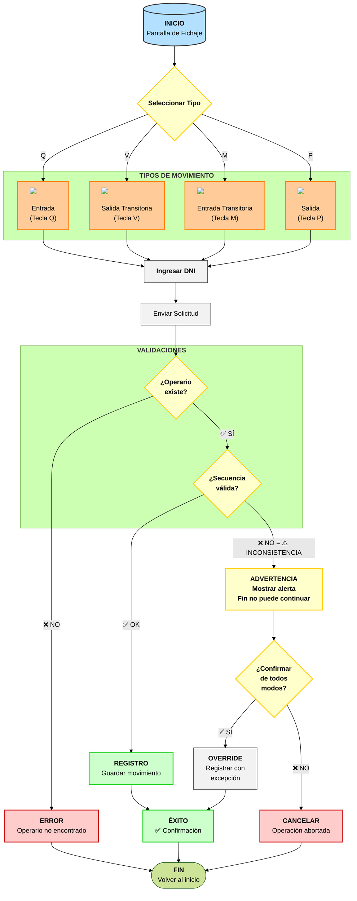
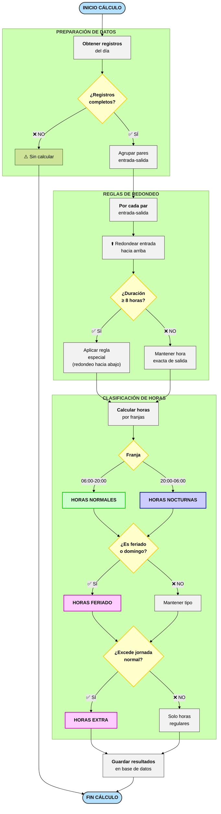
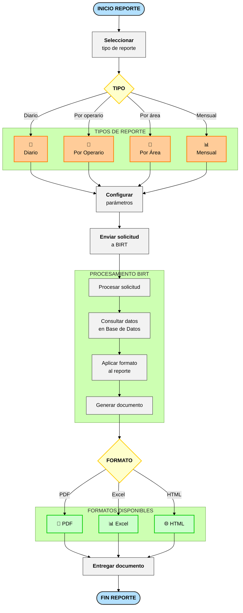
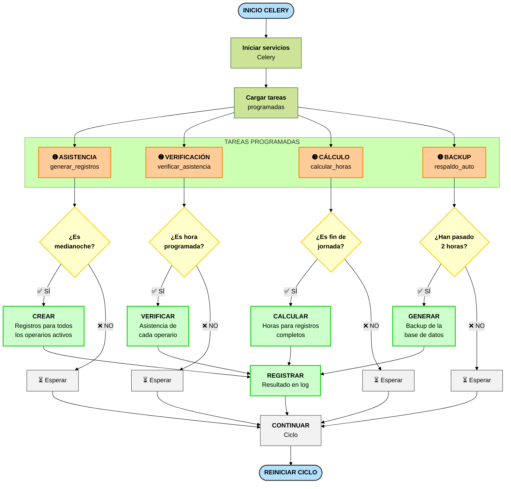
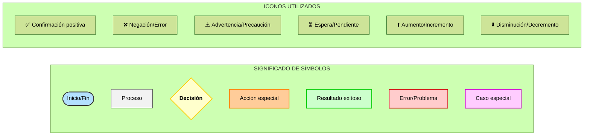

# Diagrama de Flujo Visual - Sistema Reloj Fichador

  

> [!info] Navegación

> **Índice Principal:** [[Indice_Reloj_Fichador|Índice del Sistema]]  

> **Contexto:** [[contexto|Contexto del Proyecto]]  

> **Otras Visualizaciones:** [[Diagrama_de_flujo_Fichador|Mermaid]] | [[Diagrama_de_flujo_ASCII|ASCII]]  

> **Arquitectura:** [[estructura|Estructura del Proyecto]]

  

Este documento presenta diagramas visuales mejorados del sistema Reloj Fichador con elementos gráficos avanzados para facilitar su comprensión.

  

## Proceso Principal de Fichaje

  

  

## Validación de Inconsistencias

```mermaid

%%{init: { 'theme': 'forest' } }%%

flowchart TB

    classDef proceso fill:#f2f2f2,stroke:#333,stroke-width:1px,color:#000

    classDef inconsistencia fill:#ffcccc,stroke:#cc0000,stroke-width:2px,color:#000

    classDef consistente fill:#ccffcc,stroke:#00cc00,stroke-width:2px,color:#000

    classDef movimiento fill:#ffcc99,stroke:#ff8000,stroke-width:2px,color:#000

    classDef validacion fill:#ffffcc,stroke:#ffcc00,stroke-width:2px,color:#000,font-weight:bold

    subgraph ValBasicas["<b>VALIDACIONES PREVIAS</b>"]
        direction TB
        Z1{"¿Tiene un registro<br>de salida el día<br>de ayer?"}
        Z1 -->|"SÍ"| Z2["Validación especial<br>de continuidad"]
        Z1 -->|"NO"| Z3{"¿Es su primer<br>registro?"}
        Z3 -->|"SÍ"| Z4["Continuar con<br>registro normal"]
        Z3 -->|"NO"| Z5["Aplicar lógica<br>de inconsistencia"]
    end

    subgraph entrada ["ENTRADA"]
        direction TB
        A1[/"Entrada"/] --> B1{"¿Ya tiene<br>entrada?"}
        B1 -->|"SÍ"| C1["❌ INCONSISTENTE"]
        B1 -->|"NO"| D1["✅ CONSISTENTE"]
        class A1 movimiento
        class B1 validacion
        class C1 inconsistencia
        class D1 consistente
    end

    subgraph salida_trans ["SALIDA TRANSITORIA"]
        direction TB
        A2[/"Salida<br>Transitoria"/] --> B2{"¿Tiene<br>entrada<br>hoy?"}
        B2 -->|"NO"| C2["❌ INCONSISTENTE"]
        B2 -->|"SÍ"| D2{"¿Ya tiene<br>salida transitoria?"}
        D2 -->|"SÍ"| E2["❌ INCONSISTENTE"]
        D2 -->|"NO"| F2["✅ CONSISTENTE"]
        class A2 movimiento
        class B2,D2 validacion
        class C2,E2 inconsistencia
        class F2 consistente
    end

    subgraph entrada_trans ["ENTRADA TRANSITORIA"]
        direction TB
        A3[/"Entrada<br>Transitoria"/] --> B3{"¿Tiene<br>entrada<br>hoy?"}
        B3 -->|"NO"| C3["❌ INCONSISTENTE"]
        B3 -->|"SÍ"| D3{"¿Tiene<br>salida transitoria?"}
        D3 -->|"NO"| E3["❌ INCONSISTENTE"]
        D3 -->|"SÍ"| F3["✅ CONSISTENTE"]
        class A3 movimiento
        class B3,D3 validacion
        class C3,E3 inconsistencia
        class F3 consistente
    end

    subgraph salida ["SALIDA"]
        direction TB
        A4[/"Salida"/] --> B4{"¿Tiene<br>entrada<br>hoy?"}
        B4 -->|"NO"| C4["❌ INCONSISTENTE"]
        B4 -->|"SÍ"| D4{"¿Movimientos<br>transitorios<br>pendientes?"}
        D4 -->|"SÍ"| E4["❌ INCONSISTENTE"]
        D4 -->|"NO"| F4["✅ CONSISTENTE"]
        class A4 movimiento
        class B4,D4 validacion
        class C4,E4 inconsistencia
        class F4 consistente
    end

    ValBasicas --> entrada
    entrada --> salida_trans
    salida_trans --> entrada_trans
    entrada_trans --> salida


```

  

  

## Cálculo de Horas Trabajadas

  

  

## Generación de Reportes

  

  

## Tareas Programadas Automatizadas

  

  

## Leyenda y Simbología

  

  

## Notas sobre los Diagramas

  

1. **Resaltado de colores** - Cada tipo de elemento (inicio/fin, proceso, decisión, etc.) tiene su propio color para facilitar la identificación visual.

  

2. **Agrupación lógica** - Los elementos relacionados se agrupan en subgráficos con títulos descriptivos.

  

3. **Iconos** - Se utilizan iconos y símbolos para representar visualmente acciones y estados.

  

4. **Dirección del flujo** - Algunos diagramas usan flujo vertical y otros horizontal para optimizar la visualización.

  

5. **Nombres descriptivos** - Las etiquetas incluyen verbos de acción para clarificar lo que sucede en cada paso.

  

6. **Numeración** - Las tareas programadas están numeradas para facilitar su seguimiento y comprensión.

  

7. **Validaciones previas** - Se han añadido las validaciones para comprobar registros del día anterior y primer registro, fundamentales para la correcta secuencia de movimientos.

  

8. **Precisión técnica** - Se mantiene el detalle de las teclas específicas (Q, V, M, P) para cada tipo de movimiento, similar al diagrama ASCII.

  

Esta visualización mejorada ayuda a comprender rápidamente la lógica del sistema y las relaciones entre los diferentes procesos.

  

---

  

> [!tip] Documentos Relacionados

> - Para entender el contexto y reglas de negocio, consulta [[contexto|Contexto del Proyecto]]

> - Para ver los diagramas en formato estándar, ve a [[Diagrama_de_flujo_Fichador|Diagramas Mermaid]]

> - Para una visualización en ASCII art, revisa [[Diagrama_de_flujo_ASCII|Diagramas ASCII]]

> - Para entender la estructura técnica, consulta [[estructura|Arquitectura del Proyecto]]

> - Regresa al [[Indice_Reloj_Fichador|Índice Principal]]